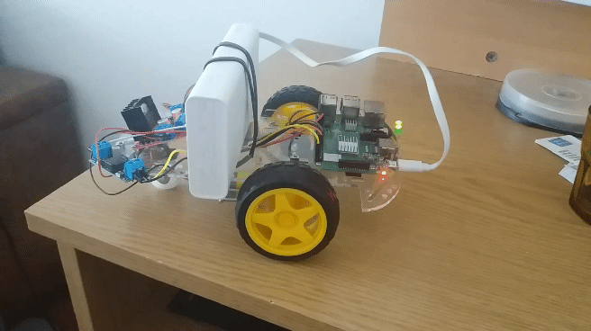

# Raspberry pi robot car


## Video streaming
Prerequisites:

Server (raspbian):
- install raspivid
- install gst-launch-1.0
- then run command below

```
raspivid -t 999999 -n -h 720 -w 1280 -fps 25 -b 2000000  -o - | gst-launch-1.0 -v fdsrc ! h264parse ! rtph264pay config-interval=1 pt=96 ! gdppay ! tcpserversink host=0.0.0.0 port=8554
```

Client:
- linux system
- install gst-launch-1.0
- if some issues install `sudo apt-get install gstreamer1.0-plugins-ba`

```
gst-launch-1.0 -v tcpclientsrc host=192.168.1.103 port=8554 ! gdpdepay ! rtph264depay ! avdec_h264 ! autovideosink
```

## 1. Remote controlled car

To run without video streamming

`python3 main.py`

To run with video streaming

`pyton3 main.py True`