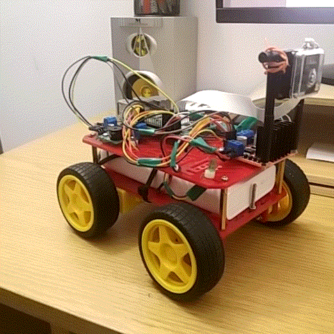

# raspberry_pi_car
Raspberry pi car main control script



## Assembly
### Motors raspberry connection
- GPIO 27 - IN 1
- GPIO 22 - IN 2
- GPIO 26 - IN 3
- GPIO 17 - IN 4

### Motors controller connection
#### Left motor:
- left side + 
- right side -

#### Right motor:
- left side - 
- right side +

#### Video streaming (almost non delay):
Prerequisites:
- Client machine should use linux system
- Install `gst-launch-1.0` on both raspbian and linux system

**Server** (raspbian)
```
raspivid -t 999999 -n -h 720 -w 1280 -fps 25 -b 2000000  -o - | gst-launch-1.0 -v fdsrc ! h264parse ! rtph264pay config-interval=1 pt=96 ! gdppay ! tcpserversink host=0.0.0.0 port=8554

```

**Client**
```

gst-launch-1.0 -v tcpclientsrc host=192.168.1.103 port=8554 ! gdpdepay ! rtph264depay ! avdec_h264 ! autovideosink

```

